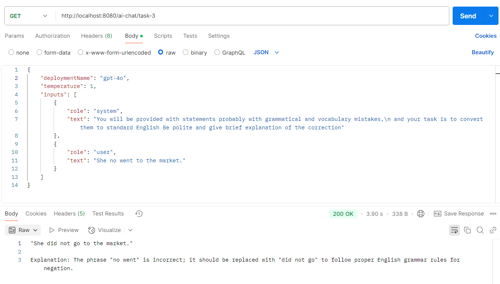
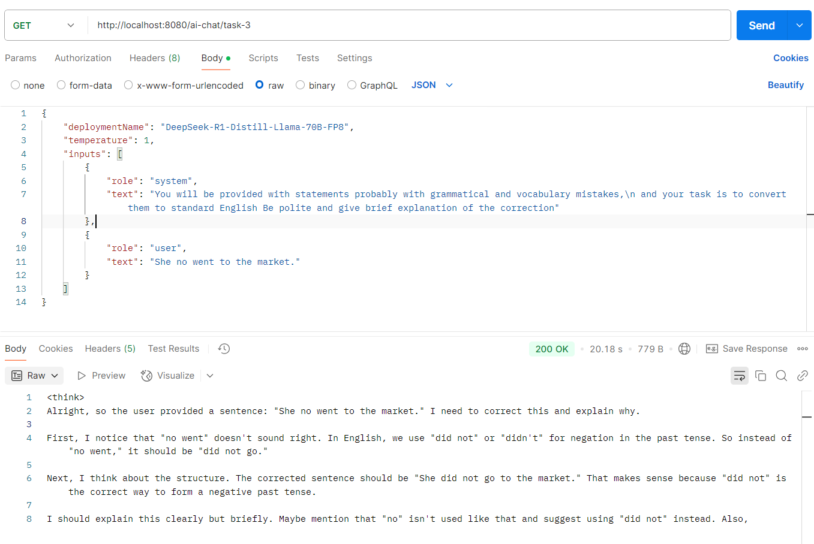
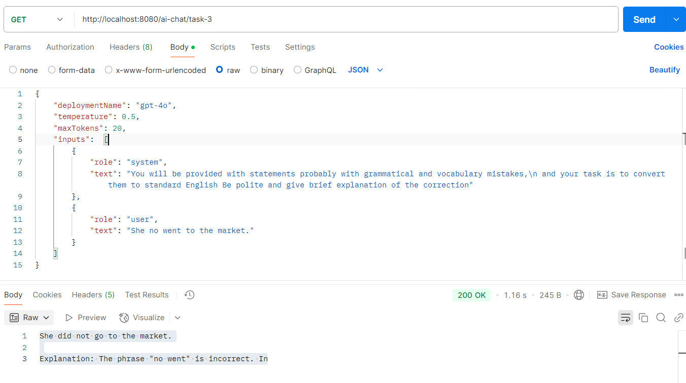
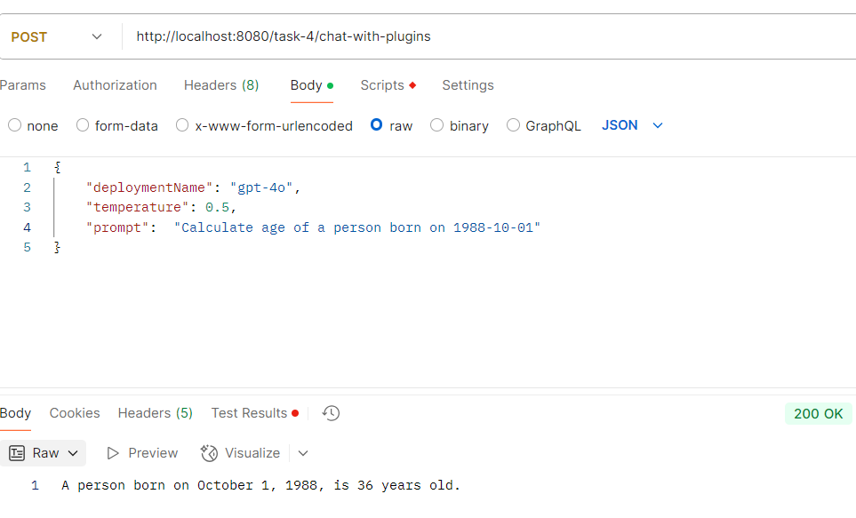
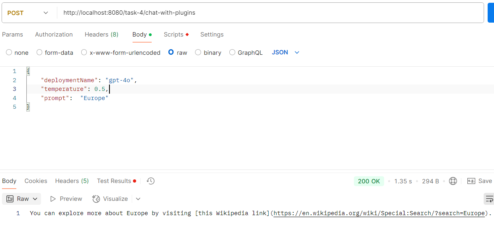
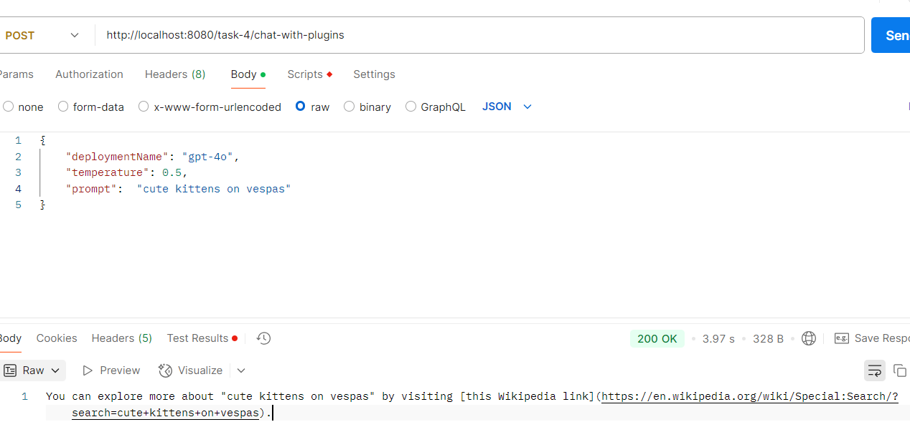
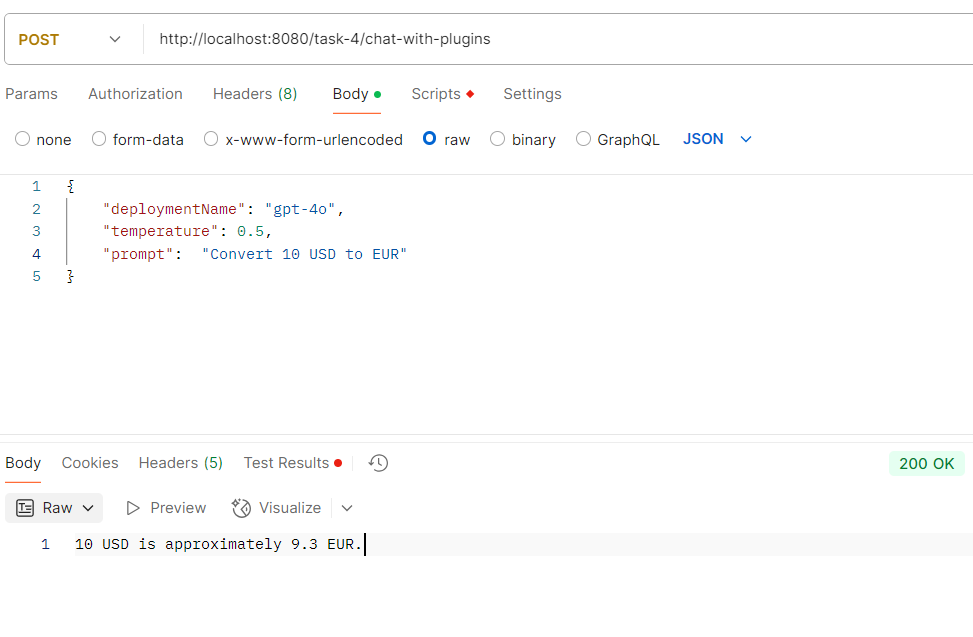
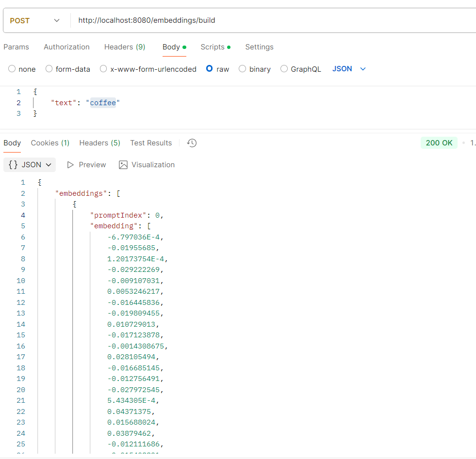
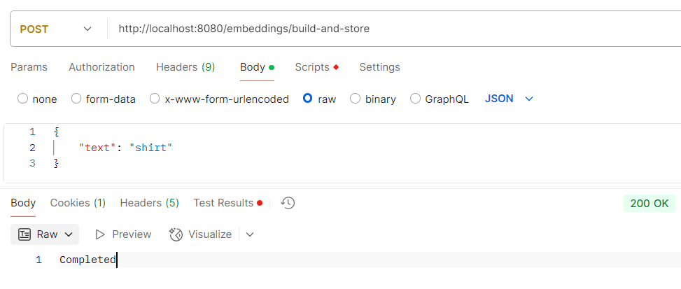
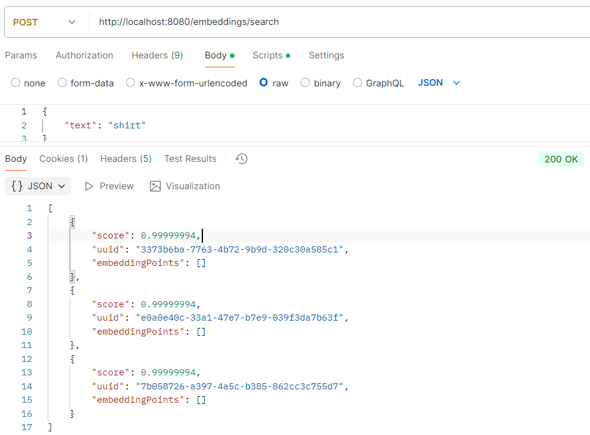

# Dynamic Model Chat Service

This is a Spring Boot application that interacts with Azure OpenAI services to dynamically process
requests using different models.

---

## Task 3 - Comparison of results for the same prompt using different models

**gpt-4o**


**DeepSeek-R1-Distill-Llama-70B-FP8**


**amazon.titan-tg1-large**


**PromptExecutionSettings**
Setting the maximum number of tokens limits the length of the output.


## Task 4 - Call function from custom plugin

### AgeCalculatorPlugin

Calculates and display ages based on user-provided birth dates


### SearchUrlPlugin

The function getWikipediaSearchUrl takes a search query
as input and generates a URL for searching that query on Wikipedia.
{ "prompt", "Europe" }


{ "query", "cute kittens on vespas" }


### Currency Converter Plugin



## Task 5 - Embeddings - Qdrant
This configuration sets up a Qdrant client to interact with the Qdrant vector database service running in a Docker container
on WSL. The container is configured to expose a publicly accessible IP address, allowing communication between the application and the Qdrant service.
1. Setup Qdrant in Docker`
2. Ensure the Qdrant container is running and publicly accessible 
3. Ensure the **qdrant.host** and **qdrant.port** configuration values match the IP and port where the Qdrant service is exposed in Docker.
4. Run the container: 
     ```
     docker run -p 6333:6333 \
       -v $(pwd)/path/to/data:/qdrant/storage \
       qdrant/qdrant
     ```
**Available Endpoints**
Build Embedding from Text (**/embeddings/build**)


Build and Store Embedding from Text (**embeddings/build-and-store**)


Search for Closest Embeddings (**/embeddings/search**)


## Task 6 - RAG (Retrieval Augmented Generation) 
**Text Generation Based on Knowledge Sources**
1. Ensure the Qdrant container is running and publicly accessible
2. Uploaded knowledge source (text or PDF) - **rag/source/upload/file** **rag/source/upload/url**
3. Generate text based on the knowledge sources -  **rag/prompt**
